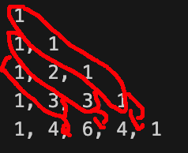

# Title

## Problem Statement

Given a non-negative integer numRows, generate the first numRows of Pascal's triangle.

Example:

```
Input: 5
Output:
[
     [1],
    [1,1],
   [1,2,1],
  [1,3,3,1],
 [1,4,6,4,1]
]
```

## My thought Process

Row 1: 1
Row 2: 1, 1
Row 3: 1, 2, 1
Row 4: 1, 3, 3, 1
Row 5: 1, 4, 6, 4, 1

Row2[0] = Row1[0] + 0 
Row2[1] = Row1[0] + 0

Row3[0] = Row2[0]
Row3[1] = Row2[1] + Row1[0]
Row3[2] = Row2[1]

Row4[0] = Row3[0]
Row4[1] = Row3[1] + Row2[0]
Row4[2] = Row3[2] + Row2[1] + Row1[0]
Row4[3] = Row3[2]



what the f brah, i wish I could write this out better. 

I'm pretty much thinking to take some position (row 4 index 2)
1. go up 1 row, check if there is a number. if not, the position is 1, else continue
2. take the number from 1 row down, add it to the number that is 1 row down and 1 position less
3. repeat step 2 until you've reached position 0 on some row. that final sum is the value in the original position

So: Row 4 index 2
1. Row 3 index 2 is 1 (total is 1)
2. Row 2 index 1 is 1 (total is 2)
3. Row 1 index 0 is 1 (total is 3). index 0 has been reached, summation is final, row 4 index 2 holds value of 3

So: Row 4 index 3
1. Row 3 index 3 does not exist, so row 4 index 3 holds value of 1

## My Solution

```golang
func generate(numRows int) [][]int {
    triangle := [][]int{}
	for currentRow := 0; currentRow < numRows; currentRow++ {
		currentRowSlice := []int{}
		for currentIndex := 0; currentIndex <= currentRow; currentIndex++ {
			posVal := findVal(currentRow, currentIndex, triangle)
			currentRowSlice = append(currentRowSlice, posVal)
		}
		triangle = append(triangle, currentRowSlice)
	}
    return triangle
}


func findVal(currentRow int, currentIndex int, currentTriangle [][]int) int {
	var value int = 0
	if currentIndex > currentRow-1 {
		return 1
	}
	for currentIndex >= 0 {
		value += currentTriangle[currentRow-1][currentIndex]
		currentIndex--
		currentRow--
	}
	return value
}
```

## My score

Speed: 0ms, faster than 100% of solutions

Memory: 2mb, lower memory usage than 17.11% of solutions

## Other Solutions and my thoughts on them

will do later